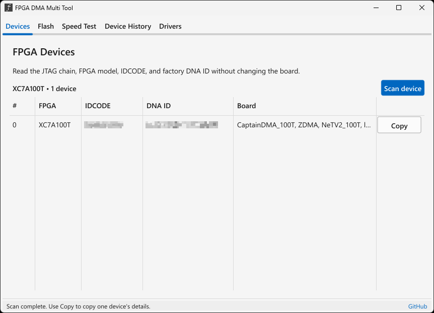
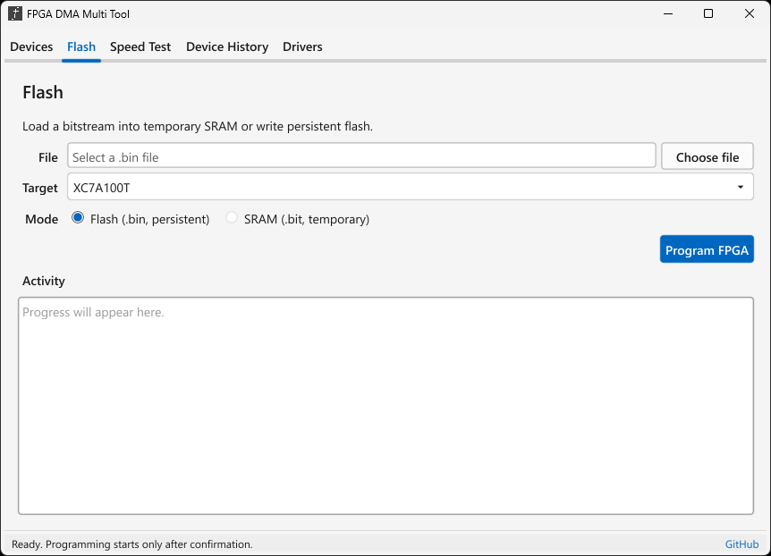
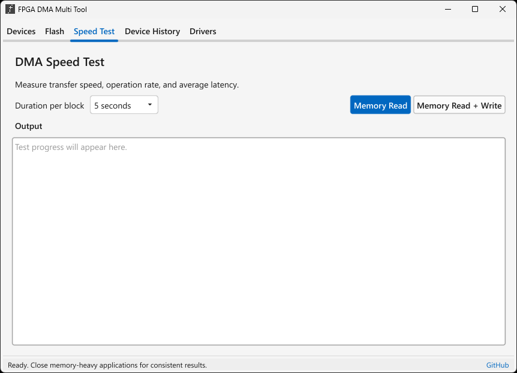
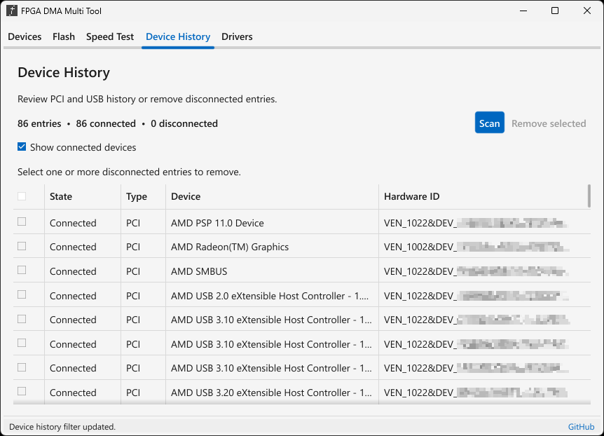
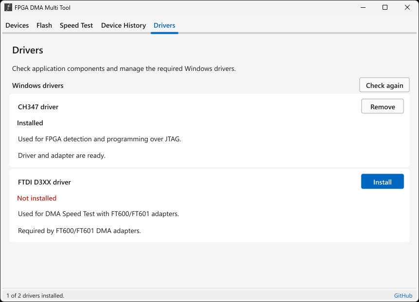

# FPGA DMA Multi Tool

A compact Windows utility for detecting, configuring, and testing supported Artix-7 FPGA boards.

## Preview

<p align="center">
  
  
  
  
  
</p>

## Features

- Detect supported Artix-7 devices and read their IDCODE and factory DNA ID
- Load bitstreams into SRAM or write persistent flash
- Measure memory read and read/write performance
- Review and remove disconnected Windows Plug and Play entries across all device classes
- Install and remove the bundled CH347, FTDI D3XX, and RS232 writer drivers
- Program through CH347 or supported FTDI/Digilent writers (0403:6010/6011/6014 Interface A)

## Download

Download the latest Windows package from [Releases](https://github.com/sercanarga/fpga-dma-multi-tool/releases/latest).

## Build

Install Docker and the pinned Fyne cross compiler:

```sh
go install github.com/fyne-io/fyne-cross@v1.6.2
```

Then build the self-contained Windows package:

```sh
make build-windows
```

Windows 10 or 11 is required. The application requests administrator access when launched.

For a release-numbered local build:

```sh
make build-windows VERSION=1.2.3
```

## Development

```sh
make check
```

`make check` verifies formatting, runs race-enabled tests and `go vet`, and
validates the pinned Windows runtime files. See
[Architecture](docs/ARCHITECTURE.md) and
[Windows runtime](docs/WINDOWS_RUNTIME.md) for the project layout and packaging
rules.
